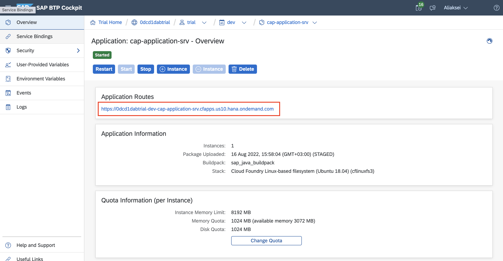
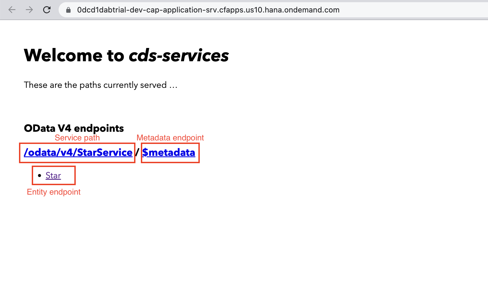

# cap_project

## Prerequisites
Ensure that you have setup a development environment as described [here](.docs/prerequisites.md)

## Start the application locally
* Navigate to root of the project (folder with mta.yaml file)
* Execute `mvn spring-boot:run`
* Check the endpoint `http://localhost:8080`
* To check CRUD operations use [postman collection](/Postman)

## Build the application
* Navigate to root of the project (folder with mta.yaml file)
* Execute `mbt build`
> The result should appear in *mta_archives* folder

## Deploy to Cloud Foundry
* Login to the space from terminal using `cf login`
* Insert API-endpoint from BTP
* Insert email and password
* Execute the command: `cf deploy mta_archives/cap-project_1.0.0.mtar`

## Check the application
* Go to the `Applications` in left navigation bar
* Select *cap-application-srv*
* Follow the link in the top section

## Overview
Application based on CAP framework please check the [documentation](https://cap.cloud.sap/docs/)
* The project is built using maven and results are packaging to .jar archive.
* Application works with in-memory database SQlite - don't need to configure any services on BTP.
* [/db](/db) folder
* I. [models.cds](/db/models.cds) - stores project entities
* II. [com.leverx.star-Star.csv](/db/data/com.leverx.star-Star.csv) - stores initial data
* [/srv](/srv) folder
* I. [/srv/src](/srv/src) - Spring Boot application
* II. [/srv/service.cds](/srv/service.cds) - CAP service. Declare entities available via OData
* III. [/srv/src/gen/](/srv/src/gen/) - folder stores interfaces which we can use with Java (Just after build phase)
* After deployment start page has metadata and service endpoints

